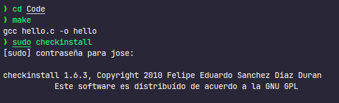
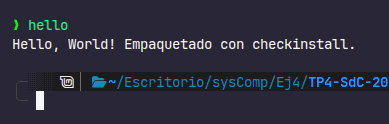
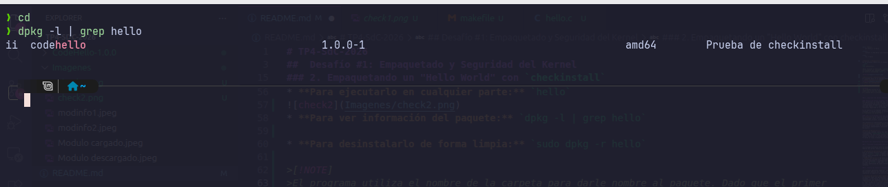
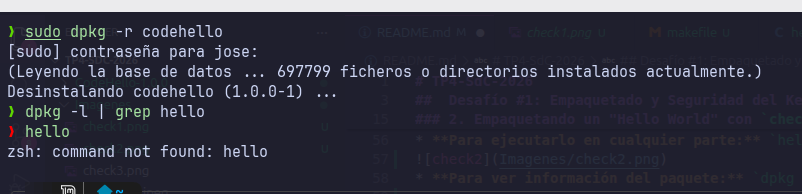
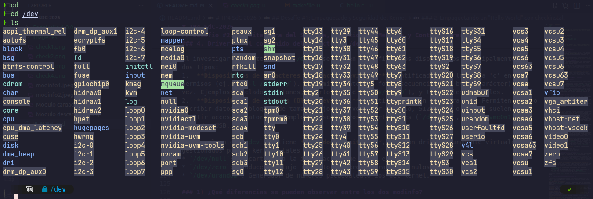
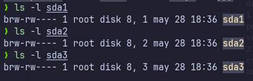
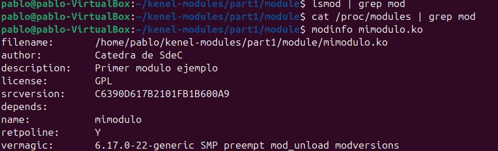
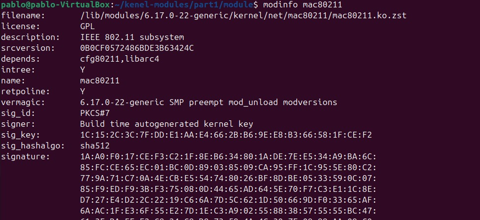

# TP4-SdC-2026

##  Desafío #1: Empaquetado y Seguridad del Kernel

### 1. ¿Qué es `checkinstall` y para qué sirve?

`checkinstall` es una herramienta de línea de comandos para sistemas operativos tipo Unix diseñada para facilitar la gestión de programas que se compilan a partir de su código fuente. Esta herramienta genera un paquete instalable como `.deb` o `.tgz`.

Normalmente, al compilar software manualmente, el último paso es ejecutar `make install`. Este comando copia los binarios y archivos directamente a los directorios del sistema operativo (`/usr/local/bin`, etc.). El gran problema de esto es que el gestor de paquetes del sistema, como APT, no se entera de esta instalación, lo que hace que rastrear y desinstalar estos archivos en el futuro sea más difícil y propenso a ensuciar el sistema.

Posteriomente los programas instalados con checkinstall se pueda desinstalar limpiamente usando comandos convencionales como `apt-get remove` o `dpkg -r`.

---

### 2. Empaquetando un "Hello World" con `checkinstall`

Para demostrar su uso con un programa clásico de "Hola Mundo" en C, es requisito que el proyecto cuente con un archivo `Makefile` que incluya una regla de instalación (`install`).

**`hello.c`**
```c
#include <stdio.h>

int main() {
    printf("Hello, World! Empaquetado con checkinstall.\n");
    return 0;
}
```

**`Makefile`**
Debe contener las instrucciones para compilar y para instalar el binario.
```makefile
all: hello

hello: hello.c
	gcc hello.c -o hello

install:
	install -m 755 hello /usr/local/bin/

clean:
	rm -f hello
```

**Compilar y Empaquetar**
En la terminal, dentro de la carpeta donde están ambos archivos, se ejecuta:
```bash
make
sudo checkinstall
```
*Nota: Durante la ejecución, `checkinstall` abrirá un asistente interactivo pidiendo confirmar los metadatos del paquete (nombre, versión, descripción, etc.). Se pueden aceptar los valores por defecto presionando `Enter`.*



**Verificación y Desinstalación**
El programa ahora es un paquete oficial en el sistema.
* **Para ejecutarlo en cualquier parte:** `hello`

* **Para ver información del paquete:** `dpkg -l | grep hello`

* **Para desinstalarlo de forma limpia:** `sudo dpkg -r hello`



>[!NOTE]
>El programa utiliza el nombre de la carpeta para darle nombre al paquete. Dado que el primer nombre que se usó fue "Code" el paquete sobreescribió el paquete de VS Code borrandolo. Tener más cuidado para la próxima.

---

### 3. Seguridad del Kernel: Módulos Firmados y Rootkits

#### Módulos del Kernel Firmados (Module Signing)
Para garantizar la integridad del sistema operativo, los kernels modernos de Linux implementan la verificación de firmas criptográficas para los módulos. Cuando esta función está activa (especialmente obligatoria si el sistema tiene *UEFI Secure Boot* habilitado), el kernel exige que cada módulo (`.ko`) posea una firma digital válida generada por una clave pública de confianza registrada en el sistema. 

Si un usuario o un programa intenta cargar un módulo que no está firmado o cuyo código ha sido alterado, el kernel bloquea la acción mediante un error de tipo *"Key was rejected by service"* o *"Operation not permitted"*.

#### ¿Qué es un Rootkit y por qué importa firmar los módulos?
Un **rootkit** es un tipo de software malicioso diseñado para otorgar acceso no autorizado de administrador (root) a un atacante, mientras oculta activamente su presencia en el sistema (escondiendo procesos, archivos maliciosos o conexiones de red).

Los rootkits más sofisticados y peligrosos operan a nivel del núcleo del sistema, conocidos como **LKM Rootkits** (*Loadable Kernel Module Rootkits*). Al insertarse como un módulo del kernel, obtienen el máximo nivel de privilegios y pueden alterar las llamadas al sistema (*syscalls*), volviéndose completamente invisibles para los antivirus tradicionales que operan en el espacio de usuario.

**Acción de Mitigación:**
La principal defensa contra los LKM rootkits es **evitar la carga de módulos no firmados** (configurando `CONFIG_MODULE_SIG_FORCE=y` al compilar el kernel o manteniendo Secure Boot encendido). De esta forma, incluso si un atacante logra obtener permisos de root y compilar su rootkit malicioso, el sistema operativo le impedirá inyectarlo en el kernel porque el atacante no posee la clave criptográfica privada necesaria para firmarlo.


## Desafío #2: Arquitectura del Sistema, Espacios de Memoria y Controladores

### 1. Funciones disponibles para un programa y un módulo

La principal diferencia entre el desarrollo de aplicaciones convencionales y el desarrollo de módulos del kernel radica en las bibliotecas de funciones a las que cada uno tiene acceso:

* **Programa de aplicación:** Tiene a su disposición la biblioteca estándar de C (como `glibc`). Esto le permite utilizar funciones comunes de manejo de memoria (`malloc`, `free`), entrada/salida (`printf`, `fopen`), manejo de cadenas (`strcpy`), entre otras. Estas funciones operan de manera segura delegando las tareas críticas al sistema operativo mediante llamadas al sistema (system calls).
* **Módulo del kernel:** No tiene acceso a ninguna biblioteca del espacio de usuario, incluida la biblioteca estándar de C. Un módulo solo puede invocar funciones que el propio kernel de Linux ha programado y exportado explícitamente para su uso (símbolos exportados). Por ejemplo, en lugar de `printf`, debe usar `printk`; en lugar de `malloc`, utiliza `kmalloc`; y no puede procesar operaciones de punto flotante de manera directa sin configuraciones especiales de contexto.

### 2. Espacio de usuario y Espacio del kernel

Los sistemas operativos modernos, como Linux, separan la memoria y los niveles de ejecución en dos grandes dominios por razones de seguridad, estabilidad y control de acceso al hardware. Esta separación se apoya en los anillos de privilegios del procesador (arquitectura x86).

* **Espacio de usuario (User Space):** Es el entorno de ejecución sin privilegios (Ring 3) donde se ejecutan todas las aplicaciones, demonios y procesos del usuario. Los programas aquí están aislados; si uno falla, el sistema operativo interviene y lo cierra (mediante un fallo de segmentación, por ejemplo), sin afectar al resto del sistema.
* **Espacio del kernel (Kernel Space):** Es el nivel de ejecución con máximos privilegios (Ring 0). Aquí reside el núcleo del sistema operativo y sus módulos. Tiene acceso total e irrestricto al procesador, a la memoria física y a todo el hardware. Un error de programación en este espacio (como una mala gestión de punteros) no se puede contener y provocará un "Kernel Panic", deteniendo todo el sistema abruptamente.

### 3. Espacio de datos

El manejo de la memoria difiere drásticamente dependiendo de dónde se esté operando:

* **Espacio de datos en User Space:** Cada programa dispone de su propio espacio de direcciones virtuales, el cual es ilusoriamente grande y continuo. El sistema operativo se encarga de traducir estas direcciones virtuales a direcciones físicas. Este espacio está dividido de forma ordenada en segmentos (código, datos inicializados, datos no inicializados/BSS, heap y stack). Además, esta memoria es "paginable" (swappable), lo que significa que el kernel puede mover temporalmente al disco rígido partes de la memoria que no se están utilizando activamente.
* **Espacio de datos en Kernel Space:** Todos los módulos del kernel comparten un único espacio de direcciones global. El kernel gestiona su propia memoria, la cual, por lo general, no es paginable y reside permanentemente en la memoria RAM principal (memoria física). El tamaño de la pila (stack) en el espacio del kernel es extremadamente limitado (típicamente 4KB u 8KB), por lo que declarar estructuras de datos locales grandes o usar recursividad profunda puede desbordar la pila rápidamente y causar un fallo catastrófico del sistema.

### 4. Drivers y el contenido del directorio /dev

Los **Controladores de Dispositivos (Drivers)** son módulos de software específicos cuya función es abstraer los detalles físicos de un componente de hardware particular, proporcionando al sistema operativo y a las aplicaciones una interfaz estándar para interactuar con él. En Linux, los drivers operan en el espacio del kernel.

En sistemas basados en UNIX, la filosofía subyacente es que "todo es un archivo". Esta filosofía se materializa en el directorio **`/dev`** (devices).

**El directorio `/dev`:**
Contiene archivos especiales de dispositivos (nodos de dispositivo). Estos archivos no almacenan datos en un disco de la manera tradicional; en su lugar, actúan como un canal de comunicación directo hacia el driver en el kernel. Cuando un programa de usuario lee o escribe en un archivo dentro de `/dev`, el kernel intercepta esa operación y transfiere los datos a la función correspondiente del driver.



Al investigar el contenido de `/dev`, se pueden clasificar los dispositivos principalmente en dos tipos:
1.  **Dispositivos de caracteres (Character devices):** Identificados con la letra 'c' en sus permisos (ej. `ls -l /dev/tty`). Transmiten datos de forma secuencial, un byte (carácter) a la vez. Ejemplos: teclados, ratones, puertos serie (`/dev/ttyS0`), y terminales virtuales.
2.  **Dispositivos de bloques (Block devices):** Identificados con la letra 'b'. Permiten leer o escribir datos en bloques de tamaño fijo a la vez (por ejemplo, 512 bytes o 4KB) y suelen admitir acceso aleatorio. Ejemplos: discos duros y particiones (`/dev/sda`, `/dev/nvme0n1`), unidades USB, etc.



Adicionalmente, `/dev` contiene **pseudodispositivos**, que son drivers puramente virtuales gestionados por el kernel, tales como:
* `/dev/null`: Descarta toda la información que se le envía.
* `/dev/zero`: Produce un flujo infinito de ceros (caracteres nulos).
* `/dev/urandom`: Generador de números pseudoaleatorios del kernel.
--- 
## Preguntas extras

### 1) ¿Qué diferencias se pueden observar entre los dos modinfo?

La diferencia principal entre las dos ejecuciones del comando `modinfo` radica en la cantidad de metadatos (información descriptiva) que el kernel puede leer del archivo compilado (`.ko`).



* **Primer `modinfo`(modinfo mimodulo.ko):** Corresponde a la compilación del módulo en su versión más básica. Al ejecutar el comando, la salida solo muestra la información técnica mínima generada automáticamente por el compilador y el entorno de construcción (*Kbuild*). Esto incluye campos obligatorios como el nombre del archivo (`filename`), la versión del kernel compatible (`vermagic`), la versión del código fuente (`srcversion`), dependencias (`depends`) y el nombre del módulo (`name`).

<br>



* **Segundo `modinfo` (modinfo /lib/modules/$(uname -r)/kernel/crypto/des_generic.ko):** Corresponde a la versión del módulo tras haberle agregado las macros de información en el código fuente en C. La gran diferencia es que la salida ahora incluye campos descriptivos legibles por humanos, los cuales son fundamentales para documentar el módulo. Se añaden explícitamente detalles como:
    * **`author`**: El nombre y/o correo del creador del módulo (generado por `MODULE_AUTHOR`).
    * **`description`**: Una breve explicación de lo que hace el módulo (generado por `MODULE_DESCRIPTION`).
    * **`license`**: El tipo de licencia del código, crucial para que el kernel sepa si el módulo es de código abierto o propietario (generado por `MODULE_LICENSE`).
    * **`version`**: La versión actual del software (generado por `MODULE_VERSION`).


### 2) ¿Qué drivers/módulos están cargados en sus propias PC?

Para visualizar la lista completa de los módulos del kernel y controladores (drivers) que se encuentran actualmente cargados en la memoria del sistema operativo, se utiliza el comando `lsmod` en la terminal.

**Uso del comando y funcionamiento:**
Al ejecutar `lsmod`, el sistema lee e interpreta la información en tiempo real contenida en el archivo virtual `/proc/modules`. La salida se presenta en un formato de tabla con tres columnas principales:

1. **Module:** Indica el nombre del módulo o controlador.
2. **Size:** Representa la cantidad de memoria (en bytes) que el módulo está ocupando en el Kernel Space.
3. **Used by:** Muestra un número que indica cuántas instancias están usando el módulo, seguido de una lista de otros módulos que dependen de él para funcionar.

**Ejemplos de módulos comunes observados:**
Dado que la lista exacta varía dependiendo del hardware físico o de la configuración de la máquina virtual de cada usuario, algunos de los módulos más representativos que se suelen encontrar cargados incluyen:

* **Controladores de video:** `vboxvideo` (en caso de VirtualBox), `nouveau`, `amdgpu` o `nvidia`.
* **Controladores de red:** `e1000` (tarjetas Intel), `iwlwifi` (redes inalámbricas).
* **Gestión de periféricos:** `usbcore` (soporte base para dispositivos USB), `hid_generic` (teclados y ratones estándar).
* **Sistemas de archivos y almacenamiento:** `ext4`, `ahci` (controladores SATA).

```txt
1a2,5
> vxlan                 155648  0
> ip6_udp_tunnel         16384  1 vxlan
> udp_tunnel             32768  1 vxlan
> ccm                    20480  6
2a7,11
> snd_seq_dummy          12288  0
> snd_hrtimer            12288  1
> vboxnetadp             28672  0
> vboxnetflt             32768  0
> vboxdrv               696320  2 vboxnetadp,vboxnetflt
7,20c16,20
< bnep                   32768  2
< ath3k                  20480  0
< btusb                  81920  0
< btrtl                  32768  1 btusb
< btintel                57344  1 btusb
< btbcm                  24576  1 btusb
< btmtk                  12288  1 btusb
< bluetooth            1036288  45 btrtl,btmtk,btintel,btbcm,bnep,ath3k,btusb,rfcomm
< ecdh_generic           16384  2 bluetooth
< ecc                    45056  1 ecdh_generic
< xt_conntrack           12288  3
< xt_MASQUERADE          16384  3
< bridge                425984  0
< stp                    12288  1 bridge
---
> snd_ctl_led            24576  0
> ledtrig_audio          12288  1 snd_ctl_led
> snd_hda_codec_realtek   208896  1
> snd_hda_codec_generic   122880  1 snd_hda_codec_realtek
> qrtr                   53248  2
```

### 3) ¿Cuáles módulos no están cargados pero están disponibles? ¿Qué pasa cuando el driver de un dispositivo no está disponible?

**Módulos disponibles pero no cargados en memoria:**
El kernel de Linux está diseñado para ser modular y eficiente. No carga todos los controladores existentes en la memoria RAM al arrancar, ya que esto consumiría recursos de forma excesiva. En su lugar, solo carga dinámicamente los módulos que el hardware actual requiere. 

Los módulos que están "disponibles" (compilados y listos para usarse) pero que no están cargados actualmente, se encuentran almacenados físicamente en el disco duro, dentro del árbol de directorios: `/lib/modules/$(uname -r)/kernel/` (donde `$(uname -r)` corresponde a la versión del kernel en ejecución). Estos archivos poseen la extensión `.ko` (Kernel Object). Para ver todos los módulos disponibles en el sistema, se puede explorar dicho directorio mediante el comando:
`find /lib/modules/$(uname -r)/ -type f -name "*.ko"`

**Consecuencias de la indisponibilidad de un driver:**
Cuando se conecta un dispositivo físico (o se intenta cargar un dispositivo virtual/lógico) y su controlador no está disponible (es decir, no está en el directorio de módulos y no fue compilado estáticamente dentro del kernel), suceden las siguientes acciones a nivel de sistema:

1. **Detección eléctrica sin inicialización lógica:** El sistema operativo es capaz de detectar que un componente fue conectado a un bus (como PCI, USB, etc.) leyendo sus identificadores básicos (Vendor ID y Product ID). Sin embargo, al no tener el driver, el kernel no sabe qué instrucciones enviarle para inicializarlo o controlarlo.
2. **Ausencia de archivo de dispositivo:** El kernel no crea el nodo de abstracción correspondiente en el directorio `/dev/` (por ejemplo, no aparecerá `/dev/video0` al conectar una cámara web). En consecuencia, los programas que operan en el espacio de usuario no tienen ninguna interfaz para interactuar con el hardware.
3. **Inoperatividad total:** El dispositivo queda inutilizable. Si se consultan los registros del sistema mediante el comando `dmesg`, se podrán observar mensajes del kernel indicando que se encontró un nuevo hardware, pero que no pudo ser "reclamado" (claimed) por ningún controlador asociado.
4. **Fallo en la carga manual:** Si el archivo `.ko` no fue compilado correctamente para la arquitectura y versión exacta de las cabeceras del kernel en uso (como ocurrió durante los errores de compilación previos en el desarrollo del módulo propio), herramientas como `insmod` o `modprobe` fallarán al intentar inyectarlo en el sistema, arrojando errores de formato inválido o símbolos no encontrados.

### 4) hwjose.txt

### 5) ¿Qué diferencia existe entre un módulo y un programa?

Existen diferencias arquitectónicas fundamentales entre un programa convencional y un módulo del kernel:

* **Espacio de Ejecución:** Un programa se ejecuta en el **Espacio de Usuario (User Space)**, lo que significa que opera con privilegios restringidos (Anillo 3). Un módulo se ejecuta en el **Espacio del Kernel (Kernel Space)**, operando con los máximos privilegios del procesador (Anillo 0) y acceso directo al hardware.
* **Punto de Entrada y Flujo:** Un programa clásico en C inicia su ejecución secuencial desde una única función principal (`main()`). En contraste, un módulo no tiene una función `main()`; está diseñado bajo un paradigma orientado a eventos. Se carga mediante una función de inicialización (`module_init`) y a partir de allí queda residente en memoria reaccionando a las llamadas que el kernel le delegue, hasta que es removido (vía `module_exit`).
* **Bibliotecas:** Los programas dependen fuertemente de las bibliotecas del espacio de usuario (como `glibc` para usar `printf` o `malloc`). Los módulos carecen de acceso a estas bibliotecas estandarizadas; deben usar exclusivamente las funciones provistas y exportadas por el propio kernel (como `printk` o `kmalloc`).
* **Tolerancia a Fallos:** Si un programa intenta realizar una operación ilegal (como acceder a memoria prohibida), el sistema operativo lo intercepta y lo cierra aisladamente sin afectar al resto del equipo. Si un módulo realiza una operación ilegal, la falta de aislamiento en el espacio del kernel genera un fallo sistémico crítico, usualmente culminando en un *Kernel Panic* que detiene por completo el sistema operativo.

### 6) ¿Cómo puede ver una lista de las llamadas al sistema que realiza un simple "Hello World" en C?

Para rastrear e inspeccionar las llamadas al sistema (system calls) que realiza un programa durante su ejecución en entornos Linux, se utiliza la herramienta de diagnóstico **`strace`**.

Una vez compilado el programa "Hello World" (por ejemplo, generando el binario ejecutable `hello`), el comando a utilizar en la terminal es:

```bash
strace ./hello
```

**Salida y Análisis:**
El comando `strace` interceptará y mostrará línea por línea cada interacción directa entre el proceso de usuario y el kernel. Aunque el código fuente original solo tenga una función `printf`, la salida de `strace` revelará múltiples llamadas al sistema subyacentes. Algunas de las más relevantes que se podrán observar incluyen:
* `execve()`: Solicitada para iniciar el proceso y cargar la imagen del ejecutable.
* `mmap()` y `mprotect()`: Utilizadas para mapear en memoria y asignar permisos a las bibliotecas compartidas necesarias dinámicamente (como `libc`).
* `write()`: Es la llamada al sistema fundamental que el kernel utiliza para escribir la cadena de texto real ("Hello World") en el descriptor de archivo 1 (Standard Output).
* `exit_group()`: Invocada al finalizar para que el kernel destruya el proceso y libere los recursos.

### 7) ¿Qué es un Segmentation Fault? ¿Cómo lo maneja el kernel y cómo lo hace un programa?

**Definición:**
Un *Segmentation Fault* (Fallo de Segmentación) es un error crítico de violación de acceso a la memoria. Ocurre cuando un proceso intenta acceder a una dirección de memoria virtual que no le ha sido asignada legalmente por el sistema operativo, o cuando intenta realizar una operación no autorizada en un segmento de memoria válido (por ejemplo, intentar escribir datos en una región marcada exclusivamente como de solo lectura).

**Manejo por parte del Kernel:**
Cuando un proceso realiza un acceso indebido, la Unidad de Gestión de Memoria del procesador (MMU) lo detecta a nivel de hardware y lanza una excepción conocida como *Page Fault*. El kernel de Linux intercepta esta excepción inmediatamente. Al revisar las tablas de páginas del proceso y confirmar que la acción es ilegítima, el kernel interviene enviando una señal específica denominada **`SIGSEGV`** (Signal 11 - Segmentation Violation) al proceso infractor. Adicionalmente, el kernel puede generar un volcado de memoria (*core dump*) que guarda el estado exacto del programa en el momento del fallo para facilitar su depuración posterior.

**Manejo por parte del Programa:**
* **Comportamiento por defecto:** Cuando un programa que se ejecuta en el espacio de usuario recibe la señal `SIGSEGV` proveniente del kernel, su comportamiento predeterminado es abortar su ejecución de manera inmediata y anormal.
* **Comportamiento modificado:** El programador tiene la capacidad técnica de interceptar esta señal desde el código fuente utilizando llamadas al sistema para el manejo de señales (como `sigaction()`). Si el programa captura la señal, puede ejecutar un bloque de código de emergencia (manejador) antes de cerrarse, lo cual se suele utilizar para escribir un registro en un archivo log o liberar recursos de red de forma prolija. Sin embargo, no se considera seguro ni viable intentar reanudar la ejecución normal del programa tras interceptar un Segmentation Fault, dado que el estado interno de la memoria del programa ya se considera corrupto.

### 11) Análisis de caso: Incidente de Secure Boot y GRUB 

**¿Cuál fue la consecuencia principal del parche de Microsoft sobre GRUB en sistemas con arranque dual (Linux y Windows)?**

La consecuencia principal fue la inoperatividad del sistema operativo Linux en configuraciones de arranque dual (dual-boot). El parche de Windows Update introdujo una actualización en la política SBAT (Secure Boot Advanced Targeting) cuyo objetivo era revocar certificados de gestores de arranque Linux antiguos y vulnerables. Sin embargo, la implementación fue defectuosa y terminó bloqueando versiones modernas, legítimas y seguras de GRUB. Como resultado, al intentar iniciar la partición de Linux, los sistemas afectados rechazaban el arranque arrojando un mensaje de error de "Violación de la Política de Seguridad" (Security Policy Violation) o "Algo salió mal", impidiendo la carga del kernel de Linux.

**¿Qué implicancia tiene desactivar Secure Boot como solución al problema descrito en el artículo?**

Deshabilitar Secure Boot desde la configuración UEFI/BIOS permite evadir el bloqueo y lograr que Linux vuelva a arrancar (sirviendo como una solución temporal o *workaround*). No obstante, la implicancia es una degradación crítica en la postura de seguridad del equipo. Al apagar esta función, se elimina la validación de firmas criptográficas durante el inicio, dejando al sistema entero (incluyendo la instalación de Windows que comparte la máquina) vulnerable a ataques de nivel de firmware, tales como *bootkits* y *rootkits*. Estos tipos de malware se inicializan antes que el sistema operativo y el software antivirus, logrando persistencia total y control absoluto sobre el hardware.

**¿Cuál es el propósito principal del Secure Boot en el proceso de arranque de un sistema?**

El propósito fundamental de Secure Boot (Arranque Seguro), una característica del estándar UEFI, es establecer y mantener una "cadena de confianza" (Chain of Trust) desde el instante en que se enciende el hardware. Su función es garantizar que cada pieza de software que participa en la secuencia de arranque (el firmware, el gestor de arranque, los módulos y el propio kernel del sistema operativo) posea una firma digital válida emitida por una autoridad reconocida (OEM, Microsoft, etc.). Si algún componente carece de firma, o si su firma está revocada o alterada (indicando una posible inyección de código malicioso), el sistema detiene el proceso de arranque para proteger la integridad del equipo.
